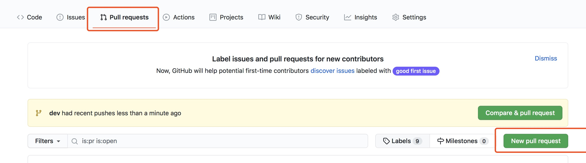

# git使用规范参考.md

### 1、从github拉取新项目使用https协议

### 2、开发时候需要安装一定的git flow进行版本控制，主要有以下原则和常用命令：

#### 2.1 不能直接在master或者main分支上面进行开发，代码拉取下来一般是默认master分支或者main分支，而且要牢记，之后每次从master分支切新分支时，要使用
    git pull

来拉去mater分支到最新代码，然后要使用命令
    
    git checkout -b 新分支名称
    
从当前分支切出新分支进行开发。

#### 2.2 开发到一定程度的时候，需要保存代码到代码仓库，此时使用命令
    git commit -a -m "自己想写信息，主要是这次提交包含了哪些内容"
    
来保存当前的版本，然后把当前分支已经保存到代码提交到远程仓库时，需要分两种情况：第一种是当前分支是第一次切出来到分支，需要使用命令
    
    git push -u origin 新分支名称

这样能把新分支提交到远程仓库，也就是github仓库中，如果分支之前已经提交到远程仓库了，使用

    git push 

即可。

### 3、合并分支代码到master分支时，为避免合并冲突，第一步需要使用

    git commit -a -m "自己想写信息，主要是这次提交包含了哪些内容"
先保存代码到本地git仓库。然后使用命令
    
    git checkout master
    
切换到master分支，使用

    git pull
拉取master分支最新代码，然后使用

    git checkout 分支名称

切换到自己到分支，再使用

    git merge master

合并master分支的内容到自己的分支，目的是别人之前在mater分支上合并过代码，此时你在本地合并
master时有可能会产生冲突，即你们有可能改了相同的地方，这一步完成之后使用

    git push
将自己的分支推送到远程仓库。然后在github上提交pull request

选择要合并的分支，然后写好日志信息就可以提交等待代码审核人合并代码

    

